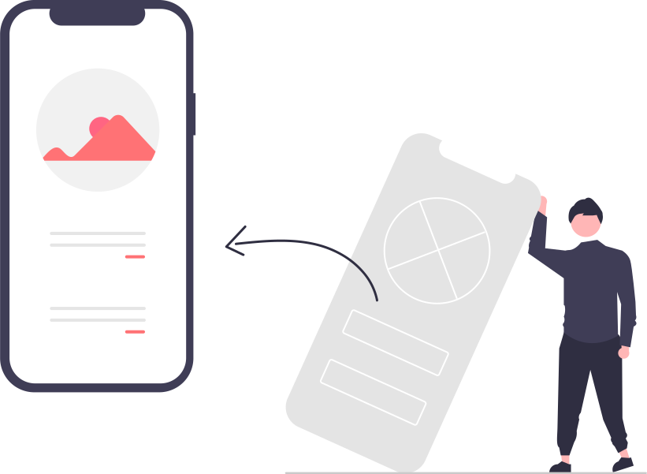
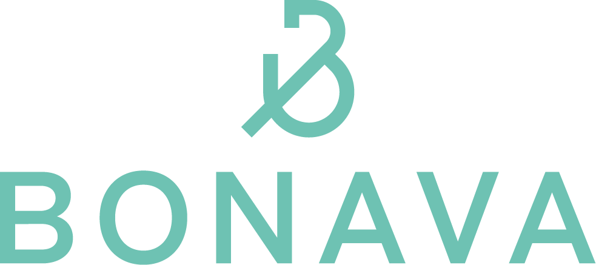

<!DOCTYPE html>
<html lang="en">
<head>
    <meta charset="UTF-8">
    <meta http-equiv="X-UA-Compatible" content="IE=edge">
    <meta name="viewport" content="width=device-width, initial-scale=1.0">
    <title>Document</title>

    <link href="https://cdn.jsdelivr.net/npm/bootstrap@5.1.1/dist/css/bootstrap.min.css" rel="stylesheet" 
    integrity="sha384-F3w7mX95PdgyTmZZMECAngseQB83DfGTowi0iMjiWaeVhAn4FJkqJByhZMI3AhiU" crossorigin="anonymous">

    <link rel="stylesheet" href="https://cdn.jsdelivr.net/npm/bootstrap-icons@1.3.0/font/bootstrap-icons.css">

    <link rel="stylesheet" href="style.css">
</head>
<body id="body" class="bg-dark">
<nav class="navbar navbar-expand-lg bg-dark navbar-dark py-3 fixed-top shadow">
     

        <a href="index.html" class="navbar-brand h1">Björn Malmborg</a>

       <button 
        class="navbar-toggler" 
        type="button"
        data-bs-toggle="collapse"
        data-bs-target="#navmenu"
        >
        
    </button>

    

        <ul class="navbar-nav ms-auto">
            <li class="nav-item">
                <a href="#about" class="nav-link">About</a>
            </li>
            <li class="nav-item">
                <a href="#work" class="nav-link">Work</a>
            </li>
            <li class="nav-item">
                <a href="#contact" class="nav-link">Contact</a>
            </li>
            <li class="nav-item">
                <a href="#home" class="nav-link">Home</a>
            </li>
   
        <li class="nav-item">
            <a href="#" id="modeButton" onclick="darkMode()" class="btn btn-secondary nav-link mx-5 d-none d-lg-block">Light Mode</a>
        </li>
        <li class="nav-item">
            <a href="#" onclick="darkMode()" class="nav-link d-lg-none">Light Mode</a>
        </li>
        </ul>
    

     

</nav>

<!-- jumbotron -->
    <section id="jumbo" class="bg-dark text-light p-5 p-lg-0 pt-lg-5 text-center text-sm-start">
        

            

                

                    <h1>User experience  designer </h1>
                    

                    BSc in interactiondesing and Ux-design student at Nackadmemin. A friendly teamplayer with broad knowledge
                    about the development of interactive systems.
                    

                    <button class="btn btn-primary btn-lg">Find out more</button>
                

                
            

        

    </section>

<!-- Project Cards -->

<section id="work" class="p-5">
    

        

            

                

                    

                        

                        
                    

                    <h3 class="card-title mb-3">
                        Figma projects 
                    </h3>
                    

                        Lorem ipsum dolor sit amet consectetur adipisicing elit.
                         Earum perspiciatis et temporibus quidem esse? Blanditiis, 
                         incidunt enim modi saepe, inventore at suscipit qui facilis labore recusandae pariatur culpa a mollitia.
                    

                    <a href="project1.html" class="btn btn-primary">Project details</a>

                    

                

            

            

                

                

                    

                    
                

                <h3 class="card-title mb-3">
                    SR Play
                </h3>
                

                    Lorem ipsum dolor sit amet consectetur adipisicing elit.
                     Earum perspiciatis et temporibus quidem esse? Blanditiis, 
                     incidunt enim modi saepe, inventore at suscipit qui facilis labore recusandae pariatur culpa a mollitia.
                

                <a href="#" class="btn btn-primary my-5">Project details</a>

                

            

            

                

                    

                        

                        
          
                    

                    <h3 class="card-title mb-3">
                        Case: Bonava
                    </h3>
                    

                        Lorem ipsum dolor sit amet consectetur adipisicing elit.
                         Earum perspiciatis et temporibus quidem esse? Blanditiis, 
                         incidunt enim modi saepe, inventore at suscipit qui facilis labore recusandae pariatur culpa a mollitia.
                    

                    <a href="#" class="btn btn-primary">Project details</a>

                    

                

            

        

    

</section>
<!--  About section -->
<section id="about" class="p-5 text-dark bg-light">
    

        

            

                
            

            

            <h2>Find out more about who I am, and what I do</h2>
            

                    Lorem ipsum dolor sit amet consectetur adipisicing elit. Officiis, quia inventore qui provident fuga sed.
            

            

                Lorem ipsum dolor sit amet consectetur adipisicing elit. Commodi dicta nihil numquam? Reiciendis sint unde nobis laborum. Reiciendis deleniti neque nesciunt vel culpa, dolorum ad! Veniam vero repellendus aliquam nesciunt.
            

            <a href="#" class="btn btn-light-mt-3 text-dark">
            <i class="bi bi-chevron-right text-dark"></i> More about me
            </a>
         

        

    

</section>

<section id="about" class="p-5 bg-dark">
    

        

            

            <h2>Find out more about who I am, and what I do</h2>
            

                    Lorem ipsum dolor sit amet consectetur adipisicing elit. Officiis, quia inventore qui provident fuga sed.
            

            

                Lorem ipsum dolor sit amet consectetur adipisicing elit. Commodi dicta nihil numquam? Reiciendis sint unde nobis laborum. Reiciendis deleniti neque nesciunt vel culpa, dolorum ad! Veniam vero repellendus aliquam nesciunt.
            

            <a href="#" class="btn btn-light-mt-3">
            <i class="bi bi-chevron-right"></i> More about me
            </a>
        

        

            
        

        

    

</section>

<!-- Contact -->

<section id="contact" class="bg-secondary text-light p-5">
    

       

           
           <h3 class="mb-3 mb-md-0">Say Hello!</h3>
           

           

               First and last name
               <input type="text" aria-label="First name" class="form-control">
               <input type="text" aria-label="Last name" class="form-control">
             

             

               Your message
               <textarea class="form-control" aria-label="With textarea"></textarea>
             

             

               <input type="text" class="form-control" placeholder="Enter email" aria-label="Recipient's username" aria-describedby="button-addon2">
               <button class="btn bg-dark btn-lg text-light" type="button" id="button-addon2">Send</button>
             

            

    

   

</section>
<section id="resume" class="p-5 bg-primary">
    

        <h2 class="text-center text-white">References</h2>
        

            Några ord från de som arbetat med mig
        

        

            

                

                    

                        
                        <h3 class="card-title mb-3">Pc Datorsson</h3>
                        
"björn jobbar jättebra och länge. Aldrig ledig jättesnabb

                        <a href="#"><i class="bi bi-linkedin text-dark mx-1"></i></a>
                        <a href="#"><i class="bi bi-twitter text-dark mx-1"></i></a>
                    

                

                
            

            

                

                    

                        
                        <h3 class="card-title mb-3">Sara Workforce</h3>
                        
"björn jobbar jättebra och länge. Aldrig ledig jättesnabb

                        <a href="https://linkedin.com"><i class="bi bi-linkedin text-dark mx-1"></i></a>
                        <a href="#"><i class="bi bi-twitter text-dark mx-1"></i></a>
                    

                

                
            

            

                

                    

                        
                        <h3 class="card-title mb-3">John Developer</h3>
                        
"Bästa jobbaren av alla faktiskt han är som en arbetsmyra som är smart" 

                        <a href="https://linkedin.com"><i class="bi bi-linkedin text-dark mx-1"></i></a>
                        <a href="#"><i class="bi bi-twitter text-dark mx-1"></i></a>
                    

                

                
            

            

                

                    

                        
                        <h3 class="card-title mb-3">Jobba McMucho</h3>
                        
"Björn gör inget annat än att jobba jättebra

                        <a href="https://linkedin.com"><i class="bi bi-linkedin text-dark mx-1"></i></a>
                        <a href="#"><i class="bi bi-twitter text-dark mx-1"></i></a>
                    

                

                
            

            
        

    

</section>

<!-- contact  -->

<!-- spacing-->

    

<!-- Footer -->

<footer class="p-5 bg-dark text-white text-center position-relative">
    

        

            Björn Malmborg &copy; 2021
        

        <a href="" class="position-absolute bottom-0 end-0 p-5">
            <i class="bi bi-arrow-up-circle h1"></i>
        </a>
    

</footer>

</body>

</html>